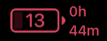

# btt-battery-widget
Upgraded battery widget for use with BetterTouchTool.

Utilizes a library of images to display the current battery percentage. Time remaining displayed "stacked" to save space on the right. Comment out if not desired.

Blinking display when charging; colorized display based on charge value. 
